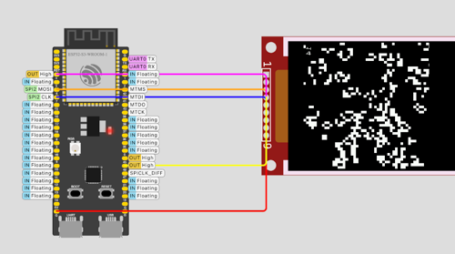
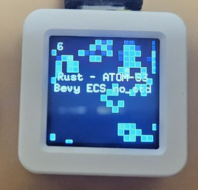
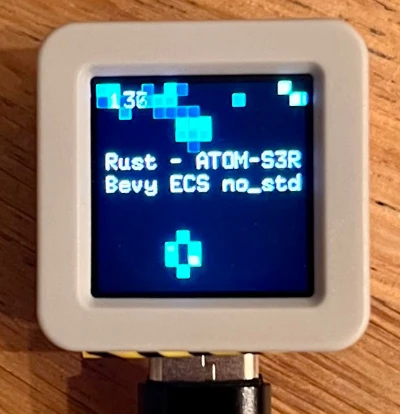
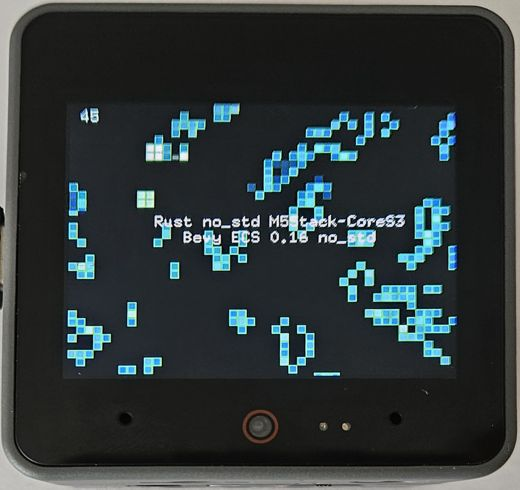
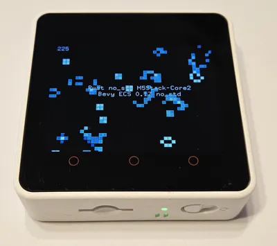
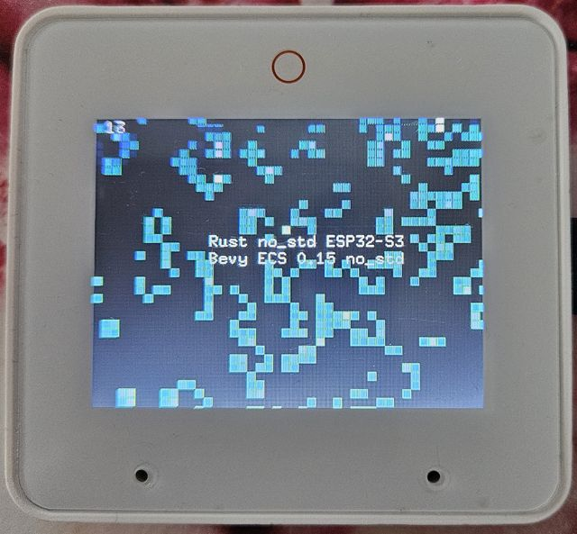
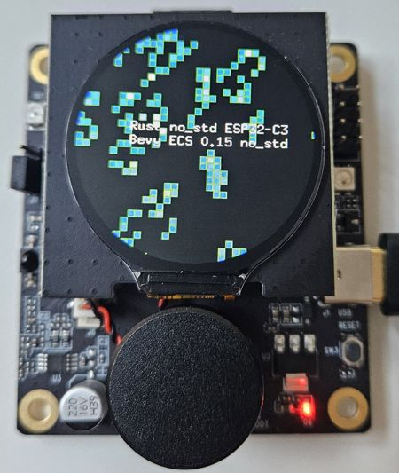
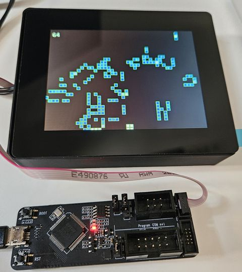
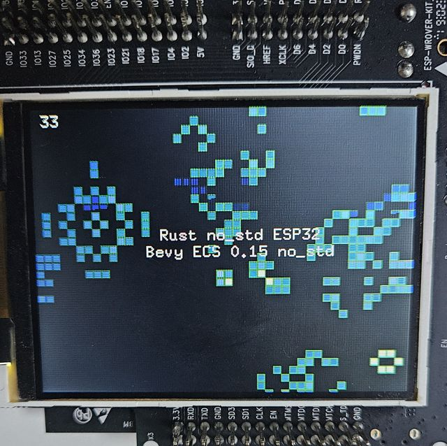

# ESP32 Conway's Game of Life in Rust

Implementation of Conway's Game of Life Rust Bare Metal.

[](https://wokwi.com/projects/380370193649185793)



Note: For more complex Rust no_std example, check [Spooky Maze Game](https://github.com/georgik/esp32-spooky-maze-game/)

## Recommended Tools

- [CLion with Rust and Wokwi plugins](https://plugins.jetbrains.com/plugin/23826-wokwi-simulator)
- [VS Code with Rust and Wokwi plugin](https://docs.wokwi.com/vscode/getting-started)

## Dependencies and Requirements

This project uses ESP-HAL for Rust bare-metal development on ESP32 microcontrollers. The examples support various ESP32 boards with different configurations including PSRAM, DMA, Embassy, and display interfaces.

### Toolchain Requirements

Most examples require the ESP Rust toolchain. For ESP32-S3 boards, use toolchain version 1.85.0.0 or later (for Edition 2024 support). For original ESP32 (Xtensa), use the stable toolchain.

Install the toolchain:
```bash
cargo install espup
espup install
source ~/export-esp.sh
```

### Software Versions

- **Bevy ECS**: 0.18.1 (official release, used across all projects)
- **esp-hal**: 1.1.0
- **Rust Edition**: 2024
- **Targets**: xtensa-esp32s3-none-elf, xtensa-esp32-none-elf, riscv32imc-unknown-none-elf, riscv32imac-unknown-none-elf, wasm32-wasi

## Supported boards

### ESP32-S3-BOX-3 Minimal Implementation

- https://github.com/espressif/esp-box

The implementation is based on Rust no_std, using mipidsi crate.

```
cd esp32-s3-box-3-minimal
cargo run --release
```

### Waveshare ESP32-C6-LCD 1.47

[Rust Bare Metal no_std](https://developer.espressif.com/blog/2025/02/rust-esp-hal-beta/) with [Bevy ECS no_std](https://github.com/bevyengine/bevy/issues/15460) on 1.47 inch [ESP32-C6 LCD Waheshare](https://www.waveshare.com/esp32-c6-lcd-1_47.htm) with DMA and framebuffer - [Conway's Game of Life](https://github.com/georgik/esp32-conways-game-of-life-rs/tree/main/esp32-c6-waveshare-1_47):

<video src="https://github.com/user-attachments/assets/e9d48ff7-b14c-4874-9521-fe59e915bc76" controls width="640">
View the video [here](https://github.com/user-attachments/assets/e9d48ff7-b14c-4874-9521-fe59e915bc76).
</video>

The implementation is based on Rust no_std and Bevy ECS no_std, plus mipidsi crate.

```
cd waveshare-esp32-c6-lcd-1_28
cargo run --release
```

### Waveshare ESP32-S3-Touch-LCD 1.28


[Rust Bare Metal no_std](https://developer.espressif.com/blog/2025/02/rust-esp-hal-beta/) with [Bevy ECS no_std](https://github.com/bevyengine/bevy/issues/15460) on [Waheshare ESP32-S3 LCD Touch 1.28 inch](https://www.waveshare.com/esp32-c6-lcd-1_47.htm) with DMA and framebuffer:

The implementation is based on Rust no_std and Bevy ECS no_std, plus mipidsi crate.

```
cd waveshare-esp32s3-touch-lcd-1_28
cargo run --release
```

### Waveshare ESP32-S3-Touch-AMOLED 1.8


[Rust Bare Metal no_std](https://developer.espressif.com/blog/2025/02/rust-esp-hal-beta/) with [Bevy ECS no_std](https://github.com/bevyengine/bevy/issues/15460) on [Waveshare ESP32-S3 Touch AMOLED 1.8 inch](https://www.waveshare.com/esp32s3-touch-amoled-1_8.htm) with DMA and framebuffer:

The implementation is based on Rust no_std and Bevy ECS no_std, featuring a high-density 368x448 pixel AMOLED display with enhanced font visibility. Updated to use sh8601-rs driver from GitHub (feature/esp-hal-1.1.0 branch).

```
cd waveshare-esp32s3-touch-amoled-1_8
cargo run --release
```

### M5Stack Atom-S3



- https://docs.m5stack.com/en/core/AtomS3

Controls: Press button under display to reset the game state (GPIO 41).

The implementation is based on Rust no_std, using mipidsi crate and Bevy ECS.
It requires es-rs toolchain for ESP32-S3 version at [least 1.85](https://github.com/esp-rs/rust-build/releases/tag/v1.85.0.0), because of edition 2024.

Installation of the toolchain:

```
cargo install espup
espup install --toolchain-version 1.85.0.0
source ~/export-esp.sh
```

Build:

```
cd m5stack-atom-s3
cargo run --release
```

### M5Stack Atom-S3R



- https://docs.m5stack.com/en/core/AtomS3R

Controls: Press button under display to reset the game state (GPIO 41).

The implementation is based on Rust no_std, using mipidsi crate and Bevy ECS.
It requires es-rs toolchain for ESP32-S3 version at [least 1.85](https://github.com/esp-rs/rust-build/releases/tag/v1.85.0.0), because of edition 2024.

Installation of the toolchain:

```
cargo install espup
espup install --toolchain-version 1.85.0.0
source ~/export-esp.sh
```

Build:

```
cd m5stack-atom-s3r
cargo run --release
```

### M5Stack CoreS3



- https://shop.m5stack.com/products/m5stack-cores3-esp32s3-lotdevelopment-kit

Controls: Press the button under display to reset the game state.

Note: Press Boot button and reset to enter download mode.

The implementation is based on Rust no_std, using mipidsi crate and Bevy ECS.

Installation of the toolchain:

```
espup install --toolchain-version 1.85.0.0
source ~/export-esp.sh
```

Build:

```
cd m5stack-cores3
cargo run --release
```

### M5Stack Core2



- https://docs.m5stack.com/en/core/Core2

Controls: Press button under display to reset the game state.

Note: Press Boot button and reset to enter download mode.

The implementation is based on Rust no_std, using mipidsi crate and Bevy ECS.
This board uses the original ESP32 (Xtensa) chip with external PSRAM.

Installation of the toolchain:

```
espup install
source ~/export-esp.sh
```

Build:

```
cd m5stack-core2
cargo run --release
```

### ESP32-S3-BOX-3



- https://github.com/espressif/esp-box

The implementation is based on Rust no_std, using mipidsi crate and Bevy ECS.
It requires es-rs toolchain for ESP32-S3 version at [least 1.85](https://github.com/esp-rs/rust-build/releases/tag/v1.85.0.0), because of edition 2024.

Installation of the toolchain:

```
cargo install espup
espup install --toolchain-version 1.85.0.0
source ~/export-esp.sh
```

Build:

```
cd esp32-s3-box-3
cargo run --release
```

### ESP32-S3-LCD-Ev-Board

The configuration is for board revision v1.5.


[ESP32-S3-LCD-Ev-Board](https://docs.espressif.com/projects/esp-dev-kits/en/latest/esp32s3/esp32s3-lcd-ev-board/index.html)
is more complex when it comes to the display. Initialization sequence for the display is:
- initialize I2C
- tunnel SPI commands via I2C bus
- configure 16 GPIOs to transfer data
- all data must be transferred in one transaction (requires PSRAM)

The timing of the display must be precise, otherwise incorrect data will be displayed.

Working configuration of timing:

```rust
    // Configure the RGB display
    let config = Config::default()
        .with_clock_mode(ClockMode {
            polarity: Polarity::IdleLow,
            phase: Phase::ShiftLow,
        })
        .with_frequency(Rate::from_mhz(10))
        .with_format(Format {
            enable_2byte_mode: true,
            ..Default::default()
        })
        .with_timing(FrameTiming {
            // active region
            horizontal_active_width: 480,
            vertical_active_height: 480,
            // extend total timings for larger porch intervals
            horizontal_total_width: 600, // allow long back/front porch
            horizontal_blank_front_porch: 80,
            vertical_total_height: 600,  // allow longer vertical blank
            vertical_blank_front_porch: 80,
            // maintain sync widths
            hsync_width: 10,
            vsync_width: 4,
            // place HSYNC pulse well before active data
            hsync_position: 10,
        })
        .with_vsync_idle_level(Level::High)
        .with_hsync_idle_level(Level::High)
        .with_de_idle_level(Level::Low)
        .with_disable_black_region(false);
```

This is only bare metal implementation, does not contain Bevy ECS in this version.

```
cargo install espup
espup install --toolchain-version 1.85.0.0
source ~/export-esp.sh
```

Build:

```
cd esp32-s3-lcd-ev-board
cargo run --release
```


### ESP32-C3-LCDKit



Controls: Press button rotary button to reset the game state (GPIO 9).

```
cd esp32-c3-lcdkit
cargo run --release
```

### ESoPe SLD_C_W_S3



Board: [SDL_C_W_S3](https://esope.de/en/products)
Display: RGB [Schukat Smartwin display-concept](https://shop.schukat.com/de/de/EUR/c/ESOP)

The implementation is based on Embassy Async Rust no_std with RGB interface using esp-rtos for Embassy RTOS integration.
The display task handles DMA transfers while the game logic task updates the simulation state.

RGB displays are very time-sensitive, so the timing of the display must be precise, that's also why
one core is dedicated to the display.

The display configuration is stored in EEPROM for this specific display type.

### WASM

This is experimental implementation for WASM.

```
cd wasm
cargo run
```

Then navigate to http://localhost:8000/ in your browser.

### ESP32-WROVER-KIT

This board is no longer in production, yet it's still used by many developers.



The implementation is based on Rust no_std, using mipidsi crate and Bevy ECS.
It requires es-rs toolchain for ESP32-S3 version at [least 1.88](https://github.com/esp-rs/rust-build/releases/tag/v1.88.0.0), because of edition 2024.

Installation of the toolchain:

```
cargo install espup
espup install --toolchain-version 1.88.0.0
source ~/export-esp.sh
```

Build:

```
cd esp32-wrover-kit
cargo run --release
```

---

### WASM

This project includes a WebAssembly (WASM) version that runs directly in your browser using pure Rust toolchain (no Python or Node.js dependencies).

Build and serve WASM version:
```bash
# Build WASM package
cargo xtask build-wasm

# Build and serve on http://localhost:8000
cargo xtask serve-wasm

# Serve on custom port
cargo xtask serve-wasm --port 3000
```

The WASM version uses:
- **Bevy ECS 0.18.1** for game logic
- **wasm-pack** for building
- **miniserve** for serving (pure Rust HTTP server)

First run will automatically install required tools (wasm-pack, miniserve).

---

## Project Maintenance with xtask

This repository includes a comprehensive **Rust-based maintenance tool** that replaces shell scripts for managing multiple ESP32 embedded projects.

### Installation & Setup

1. **Clone the repository**:
   ```bash
   git clone <repository-url>
   cd esp32-conways-game-of-life-rs
   ```

2. **Install dependencies**:
   ```bash
   # Install cargo-edit for dependency updates
   cargo install cargo-edit

   # Build the xtask tool
   cargo build
   ```

3. **Set up ESP-IDF environment** (required for building):
   ```bash
   source ~/projects/esp-idf/export.sh
   ```

4. **Fix workspace issues** (one-time setup):
   ```bash
   cargo xtask fix-workspace
   ```

### Available Commands

#### List Projects
```bash
cargo xtask list
```
Shows all discovered ESP32 projects and their status.

#### Build All Projects
```bash
# Build all projects (stops on first failure)
cargo xtask build

# Build all projects (continue even if some fail)
cargo xtask build --keep-going

# Build with verbose output
cargo xtask build --verbose
```

#### Update Dependencies
```bash
# Preview available updates
cargo xtask update --dry-run

# Update to compatible versions only
cargo xtask update

# Include potentially breaking updates
cargo xtask update --incompatible

# Preview breaking changes
cargo xtask update --dry-run --incompatible
```

#### Format Code
```bash
# Format all projects using cargo fmt
cargo xtask format

# Format with verbose output
cargo xtask format --verbose
```

#### Run All Tasks
```bash
# Run: format → update (compatible) → build
cargo xtask all

# Run all tasks, continue on failures
cargo xtask all --keep-going
```

#### WASM Commands
```bash
# Build WASM package for web browser
cargo xtask build-wasm

# Build and serve WASM on http://localhost:8000
cargo xtask serve-wasm

# Serve on custom port
cargo xtask serve-wasm --port 3000
```

#### Fix Workspace Issues
```bash
# Add empty [workspace] sections to prevent conflicts
cargo xtask fix-workspace
```

#### Update Bootloader & Bevy ECS
```bash
# Preview what changes would be made
cargo xtask update-bootloader --dry-run --verbose

# Update ESP-IDF bootloader support and Bevy ECS to latest version
cargo xtask update-bootloader
```
Automatically adds ESP-IDF bootloader support with correct chip-specific features and updates Bevy ECS to the latest version across all projects.

### Development

#### Adding New Commands
The tool is designed for easy extension. To add new commands:

1. Add command to `Commands` enum in `xtask/src/main.rs`
2. Implement the command handler function
3. Add the match arm in `main()`

#### Utility Modules

The `xtask/src/modules/` directory contains specialized modules:

- **project**: Project discovery and structure
- **build**: Batch building with progress tracking
- **update**: Automated dependency management
- **config**: Build configuration cleanup
- **migrate**: API migration helpers
- **psram_feature**: PSRAM configuration updates

#### Advanced Migration Features

The xtask includes specialized migration tools for ESP-HAL upgrades:

- **Migrate PSRAM**: Converts compile-time PSRAM configuration to runtime API
- **Migrate Embassy**: Updates Embassy task spawning and initialization
- **Fix Cargo.toml**: Repairs TOML syntax errors and missing quotes
- **Scan Cargo**: Identifies and fixes corrupted Cargo.toml files

These tools have been validated across 14 ESP32 projects during the ESP-HAL 1.0.0 to 1.1.0 upgrade process.

### Build Validation

To validate the build status of all examples:

```bash
cargo xtask build --keep-going
```

This provides a comprehensive report of successful and failed builds, allowing for quick identification of compilation issues.

## Architecture Overview

This repository demonstrates multiple approaches to embedded Rust development:

1. **Blocking I/O**: Traditional bare-metal approach with direct peripheral control
2. **Bevy ECS no_std**: Entity Component System for game logic organization
3. **Embassy Async**: Async/await framework for concurrent operations (dual-core examples)
4. **DMA Transfers**: High-performance display updates using DMA

Each example is optimized for its specific hardware capabilities while maintaining consistent game logic across different platforms.


## Contributing

When adding new board support or modifying existing examples:

1. Follow the existing project structure in the `src/` directory
2. Ensure proper `rust-toolchain.toml` configuration for the target chip
3. Include appropriate `[workspace]` section in Cargo.toml
4. Test with `cargo xtask build` before committing
5. Update this README with board-specific information

### Project Maintenance

This repository includes a comprehensive Rust-based maintenance tool (xtask) for managing multiple ESP32 embedded projects. See the "Project Maintenance with xtask" section below for details on batch building, dependency updates, and code formatting across all examples.

## License

This project is open source and available under the MIT OR Apache-2.0 license.
