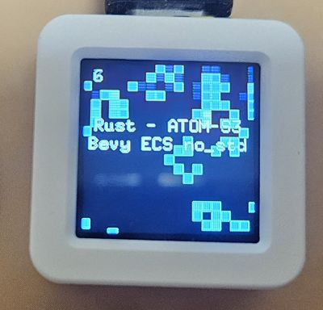
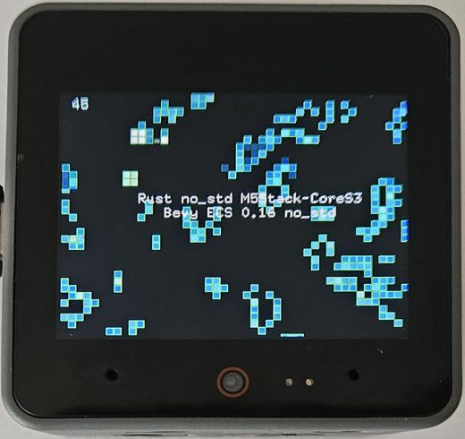
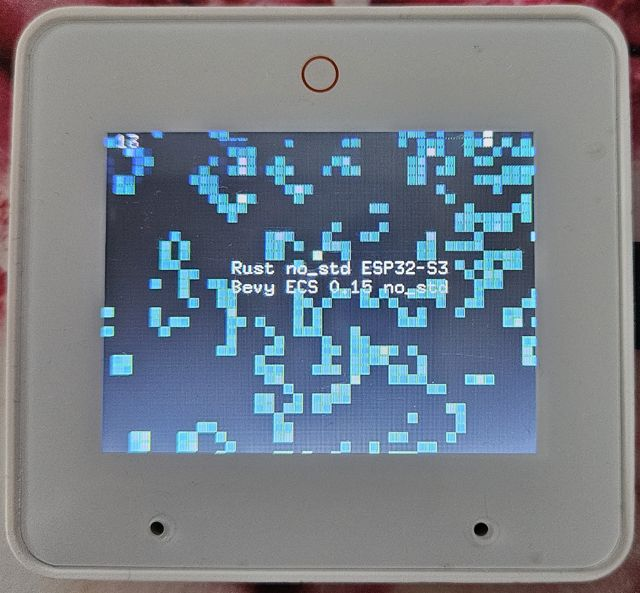

# ESP32 Conway's Game of Life in Rust

Implementation of Conway's Game of Life Rust Bare Metal.

[](https://wokwi.com/projects/380370193649185793)


## Supported boards

### ESP32-S3-BOX-3 Minimal Implementation

- https://github.com/espressif/esp-box

The implementation is based on Rust no\_std, using mipidsi crate.

```
cd esp32-s3-box-3-minimal
cargo run --release
```

### Waveshare ESP32-C6-LCD 1.47

[Rust Bare Metal no_std](https://developer.espressif.com/blog/2025/02/rust-esp-hal-beta/) with [Bevy ECS no_std](https://github.com/bevyengine/bevy/issues/15460) on 1.47 inch [ESP32-C6 LCD Waheshare](https://www.waveshare.com/esp32-c6-lcd-1.47.htm) with DMA and framebuffer - [Conway's Game of Life](https://github.com/georgik/esp32-conways-game-of-life-rs/tree/main/esp32-c6-waveshare-1_47):

<video src="https://github.com/user-attachments/assets/e9d48ff7-b14c-4874-9521-fe59e915bc76" controls width="640">
View the video [here](https://github.com/user-attachments/assets/e9d48ff7-b14c-4874-9521-fe59e915bc76).
</video>

The implementation is based on Rust no\_std and Bevy 0.16 no\_std, plus mipidsi crate.

```
cd waveshare-esp32-c6-lcd-1_28
cargo run --release
```

### Waveshare ESP32-S3-Touch-LCD 1.28


[Rust Bare Metal no_std](https://developer.espressif.com/blog/2025/02/rust-esp-hal-beta/) with [Bevy ECS no_std](https://github.com/bevyengine/bevy/issues/15460) on [Waheshare ESP32-S3 LCD Touch 1.28 inch](https://www.waveshare.com/esp32-c6-lcd-1.47.htm) with DMA and framebuffer:

The implementation is based on Rust no\_std and Bevy 0.16 no\_std, plus mipidsi crate.

```
cd waveshare-esp32-s3-touch-lcd-1_28
cargo run --release
```

### Waveshare ESP32-S3-Touch-AMOLED 1.8


[Rust Bare Metal no_std](https://developer.espressif.com/blog/2025/02/rust-esp-hal-beta/) with [Bevy ECS no_std](https://github.com/bevyengine/bevy/issues/15460) on [Waveshare ESP32-S3 Touch AMOLED 1.8 inch](https://www.waveshare.com/esp32-s3-touch-amoled-1.8.htm) with DMA and framebuffer:

The implementation is based on Rust no\_std and Bevy 0.16 no\_std, featuring a high-density 368×448 pixel AMOLED display with enhanced font visibility.

```
cd waveshare-esp32-s3-touch-amoled-1_8
cargo run --release
```

### M5Stack Atom-S3



- https://docs.m5stack.com/en/core/AtomS3

Controls: Press button under display to reset the game state (GPIO 41).

The implementation is based on Rust no\_std, using mipidsi crate and Bevy ECS.
It requires es-rs toolchain for ESP32-S3 version at [least 1.85](https://github.com/esp-rs/rust-build/releases/tag/v1.85.0.0), because of edition 2024.

Installation of the toolchain:

```
cargo install espup
espup install --toolchain-version 1.85.0.0
source ~/export-esp.sh
```

Build:

```
cd m5stack-atom-s3
cargo run --release
```

### M5Stack CoreS3



- https://shop.m5stack.com/products/m5stack-cores3-esp32s3-lotdevelopment-kit

Controls: Press the button under display to reset the game state.

Note: Press Boot button and reset to enter download mode.

The implementation is based on Rust no\_std, using mipidsi crate and Bevy ECS.

Installation of the toolchain:

```
espup install --toolchain-version 1.85.0.0
source ~/export-esp.sh
```

Build:

```
cd m5stack-cores3
cargo run --release
```

### ESP32-S3-BOX-3



- https://github.com/espressif/esp-box

The implementation is based on Rust no\_std, using mipidsi crate and Bevy ECS.
It requires es-rs toolchain for ESP32-S3 version at [least 1.85](https://github.com/esp-rs/rust-build/releases/tag/v1.85.0.0), because of edition 2024.

Installation of the toolchain:

```
cargo install espup
espup install --toolchain-version 1.85.0.0
source ~/export-esp.sh
```

Build:

```
cd esp32-s3-box-3
cargo run --release
```

### ESP32-S3-LCD-Ev-Board


[ESP32-S3-LCD-Ev-Board](https://docs.espressif.com/projects/esp-dev-kits/en/latest/esp32s3/esp32-s3-lcd-ev-board/index.html)
is more complex when it comes to the display. Initialization sequence for the display is:
- initialize I2C
- tunnel SPI commands via I2C bus
- configure 16 GPIOs to transfer data
- all data must be transferred in one transaction (requires PSRAM)

The timing of the display must be precise, otherwise incorrect data will be displayed.

Working configuration of timing:

```rust
    // Configure the RGB display
    let config = Config::default()
        .with_clock_mode(ClockMode {
            polarity: Polarity::IdleLow,
            phase: Phase::ShiftLow,
        })
        .with_frequency(Rate::from_mhz(10))
        .with_format(Format {
            enable_2byte_mode: true,
            ..Default::default()
        })
        .with_timing(FrameTiming {
            // active region
            horizontal_active_width: 480,
            vertical_active_height: 480,
            // extend total timings for larger porch intervals
            horizontal_total_width: 600, // allow long back/front porch
            horizontal_blank_front_porch: 80,
            vertical_total_height: 600,  // allow longer vertical blank
            vertical_blank_front_porch: 80,
            // maintain sync widths
            hsync_width: 10,
            vsync_width: 4,
            // place HSYNC pulse well before active data
            hsync_position: 10,
        })
        .with_vsync_idle_level(Level::High)
        .with_hsync_idle_level(Level::High)
        .with_de_idle_level(Level::Low)
        .with_disable_black_region(false);
```

This is only bare metal implementation, does not contain Bevy ECS in this version.

```
cargo install espup
espup install --toolchain-version 1.85.0.0
source ~/export-esp.sh
```

Build:

```
cd esp32-s3-lcd-ev-board
cargo run --release
```


### ESP32-C3-LCDKit


Controls: Press button rotary button to reset the game state (GPIO 9).

```
cd esp32-c3-lcdkit
cargo run --release
```

### ESoPe SLD\_C\_W\_S3


Board: [SDL\_C\_W\_S3](https://esope.de/en/products)
Display: RGB [Schukat Smartwin display-concept](https://shop.schukat.com/de/de/EUR/c/ESOP)

The implementation is based on Embassy Async Rust no\_std with RGB interface.
Both cores of ESP32-S3 are used. One core is handling DMA transfers to the display, 
while the other core is running the game logic.

RGB displays are very time-sensitive, so the timing of the display must be precise, that's also why
one core is dedicated to the display.

The display configuration is stored in EEPROM for this specific display type.

Run:
```
cd esope-sld-c-w-s3
cargo r -r
```

The board requires connection using ESP-Prog. You need to switch the board into boot mode.
Press and hold the BOOT button, then press the RESET button, then release the BOOT button.
Press the RESET button again to start the program.

### WASM

This is experimental implementation for WASM.

```
cd wasm
wasm-pack build --target web
wasm-bindgen --target web --out-dir pkg target/wasm32-unknown-unknown/release/conways_wasm.wasm
python3 -m http.server
```

### ESP32-WROVER-KIT

This board is no longer in production, yet it's still used by many developers.


The implementation is based on Rust no\_std, using mipidsi crate and Bevy ECS.
It requires es-rs toolchain for ESP32-S3 version at [least 1.85](https://github.com/esp-rs/rust-build/releases/tag/v1.85.0.0), because of edition 2024.

Installation of the toolchain:

```
cargo install espup
espup install --toolchain-version 1.85.0.0
source ~/export-esp.sh
```

Build:

```
cd esp32-wrover-kit
cargo run --release
```

## 🛠️ Installation & Setup

1. **Clone the repository**:
   ```bash
   git clone <repository-url>
   cd esp32-conways-game-of-life-rs
   ```

2. **Install dependencies**:
   ```bash
   # Install cargo-edit for dependency updates
   cargo install cargo-edit
   
   # Build the xtask tool
   cargo build
   ```

3. **Set up ESP-IDF environment** (required for building):
   ```bash
   source ~/projects/esp-idf/export.sh
   ```

4. **Fix workspace issues** (one-time setup):
   ```bash
   cargo xtask fix-workspace
   ```

## 📋 Available Commands

### List Projects
```bash
cargo xtask list
```
Shows all discovered ESP32 projects and their status.

### Build All Projects  
```bash
# Build all projects (stops on first failure)
cargo xtask build

# Build all projects (continue even if some fail)
cargo xtask build --keep-going

# Build with verbose output
cargo xtask build --verbose
```

### Update Dependencies
```bash
# Preview available updates
cargo xtask update --dry-run

# Update to compatible versions only
cargo xtask update

# Include potentially breaking updates
cargo xtask update --incompatible

# Preview breaking changes
cargo xtask update --dry-run --incompatible
```

### Format Code
```bash
# Format all projects using cargo fmt
cargo xtask format

# Format with verbose output
cargo xtask format --verbose
```

### Run All Tasks
```bash
# Run: format → update (compatible) → build
cargo xtask all

# Run all tasks, continue on failures
cargo xtask all --keep-going
```

### Fix Workspace Issues
```bash
# Add empty [workspace] sections to prevent conflicts
cargo xtask fix-workspace
```

## 🎯 Advantages Over Shell Scripts

### ✅ **Cross-Platform Reliability**
- **Pure Rust** - works on Windows, macOS, Linux
- **No shell dependencies** - no bash/zsh compatibility issues
- **Structured error handling** - clear error reporting

### ✅ **Advanced Features**
- **Parallel processing** - faster than sequential shell scripts
- **Detailed reporting** - comprehensive summaries and warnings
- **Dry-run mode** - preview changes before applying
- **Selective execution** - continue on failures with `--keep-going`

### ✅ **Maintainable Code**
- **Type safety** - compile-time error checking  
- **Structured CLI** - using `clap` for robust argument parsing
- **Async support** - efficient I/O operations
- **Easy extension** - add new commands easily

## 📊 Example Output

### Project Listing
```
📋 Discovered ESP32 Projects (12 total):
┌─────┬──────────────────────────────────────────────┬────────────┐
│ #   │ Project Name                                 │ Status     │
├─────┼──────────────────────────────────────────────┼────────────┤
│   1 │ esope-sld-c-w-s3                             │ ✅ Ready   │
│   2 │ esp32-c3-lcdkit                              │ ✅ Ready   │
│   3 │ esp32-c6-memory-lcd                          │ ✅ Ready   │
└─────┴──────────────────────────────────────────────┴────────────┘

📊 Summary: 12 ready for build, 0 missing Cargo.toml
```

### Build Summary
```
📊 Build Summary:
✅ Successfully built: 11 projects
❌ Failed to build: 1 projects
⚠️  Total warnings: 3

Projects with warnings:
  • esp32-c6-memory-lcd (1 warnings)
  • esp32-wrover-kit (2 warnings)
```

### Dependency Updates
```
📦 Processing: esp32-s3-box-3
   name          old req compatible latest new req note        
   esp-backtrace 0.16.0  0.16.0     0.17.0 0.16.0  incompatible
   esp-println   0.14.0  0.14.0     0.15.0 0.14.0  incompatible
   heapless      0.8.0   0.8.0      0.9.1  0.8.0   incompatible
✅ Dependencies updated: esp32-s3-box-3
```

## 🔧 Development

### Adding New Commands
The tool is designed for easy extension. To add new commands:

1. Add command to `Commands` enum in `xtask/src/main.rs`
2. Implement the command handler function
3. Add the match arm in `main()`

### Project Patterns
Projects are discovered using these patterns:
- `esope*` - ESOPE boards
- `esp32*` - ESP32 development boards  
- `m5stack*` - M5Stack boards
- `waveshare*` - Waveshare boards

## 🚨 Requirements

- **Rust toolchain** - latest stable
- **ESP-IDF environment** - properly sourced for building
- **cargo-edit** - for dependency updates (`cargo install cargo-edit`)

## 💡 Tips

1. **Always run `cargo xtask fix-workspace`** after cloning to resolve workspace conflicts
2. **Use `--dry-run`** before applying dependency updates to preview changes
3. **Use `--keep-going`** for builds to see all failures at once
4. **Check warnings** in build output - they often indicate potential issues

## 🎉 Migration from Shell Scripts

This tool **replaces**:
- ✅ `format_projects.sh` → `cargo xtask format`  
- ✅ `test_builds.sh` → `cargo xtask build`
- ✅ `update-deps/` → `cargo xtask update`

**Benefits**: More reliable, faster, better error handling, cross-platform compatibility.

---

## 📦 Project Maintenance with xtask

This repository includes a comprehensive **Rust-based maintenance tool** that replaces shell scripts for managing multiple ESP32 embedded projects.

### 🛠️ Installation & Setup

1. **Clone the repository**:
   ```bash
   git clone <repository-url>
   cd esp32-conways-game-of-life-rs
   ```

2. **Install dependencies**:
   ```bash
   # Install cargo-edit for dependency updates
   cargo install cargo-edit
   
   # Build the xtask tool
   cargo build
   ```

3. **Set up ESP-IDF environment** (required for building):
   ```bash
   source ~/projects/esp-idf/export.sh
   ```

4. **Fix workspace issues** (one-time setup):
   ```bash
   cargo xtask fix-workspace
   ```

### 📋 Available Commands

#### List Projects
```bash
cargo xtask list
```
Shows all discovered ESP32 projects and their status.

#### Build All Projects  
```bash
# Build all projects (stops on first failure)
cargo xtask build

# Build all projects (continue even if some fail)
cargo xtask build --keep-going

# Build with verbose output
cargo xtask build --verbose
```

#### Update Dependencies
```bash
# Preview available updates
cargo xtask update --dry-run

# Update to compatible versions only
cargo xtask update

# Include potentially breaking updates
cargo xtask update --incompatible

# Preview breaking changes
cargo xtask update --dry-run --incompatible
```

#### Format Code
```bash
# Format all projects using cargo fmt
cargo xtask format

# Format with verbose output
cargo xtask format --verbose
```

#### Run All Tasks
```bash
# Run: format → update (compatible) → build
cargo xtask all

# Run all tasks, continue on failures
cargo xtask all --keep-going
```

#### Fix Workspace Issues
```bash
# Add empty [workspace] sections to prevent conflicts
cargo xtask fix-workspace
```

### 🎯 Advantages Over Shell Scripts

#### ✅ **Cross-Platform Reliability**
- **Pure Rust** - works on Windows, macOS, Linux
- **No shell dependencies** - no bash/zsh compatibility issues
- **Structured error handling** - clear error reporting

#### ✅ **Advanced Features**
- **Parallel processing** - faster than sequential shell scripts
- **Detailed reporting** - comprehensive summaries and warnings
- **Dry-run mode** - preview changes before applying
- **Selective execution** - continue on failures with `--keep-going`

#### ✅ **Maintainable Code**
- **Type safety** - compile-time error checking  
- **Structured CLI** - using `clap` for robust argument parsing
- **Async support** - efficient I/O operations
- **Easy extension** - add new commands easily

### 📊 Example Output

#### Project Listing
```
📋 Discovered ESP32 Projects (12 total):
┌─────┬──────────────────────────────────────────────┬────────────┐
│ #   │ Project Name                                 │ Status     │
├─────┼──────────────────────────────────────────────┼────────────┤
│   1 │ esope-sld-c-w-s3                             │ ✅ Ready │
│   2 │ esp32-c3-lcdkit                              │ ✅ Ready │
│   3 │ esp32-c6-memory-lcd                          │ ✅ Ready │
└─────┴──────────────────────────────────────────────┴────────────┘

📊 Summary: 12 ready for build, 0 missing Cargo.toml
```

#### Build Summary
```
📊 Build Summary:
✅ Successfully built: 11 projects
❌ Failed to build: 1 projects
⚠️  Total warnings: 3

Projects with warnings:
  • esp32-c6-memory-lcd (1 warnings)
  • esp32-wrover-kit (2 warnings)
```

#### Dependency Updates
```
📦 Processing: esp32-s3-box-3
   name          old req compatible latest new req note        
   esp-backtrace 0.16.0  0.16.0     0.17.0 0.16.0  incompatible
   esp-println   0.14.0  0.14.0     0.15.0 0.14.0  incompatible
   heapless      0.8.0   0.8.0      0.9.1  0.8.0   incompatible
✅ Dependencies updated: esp32-s3-box-3
```

### 🔧 Development

#### Adding New Commands
The tool is designed for easy extension. To add new commands:

1. Add command to `Commands` enum in `xtask/src/main.rs`
2. Implement the command handler function
3. Add the match arm in `main()`

#### Project Patterns
Projects are discovered using these patterns:
- `esope*` - ESOPE boards
- `esp32*` - ESP32 development boards  
- `m5stack*` - M5Stack boards
- `waveshare*` - Waveshare boards

### 🚨 Requirements

- **Rust toolchain** - latest stable
- **ESP-IDF environment** - properly sourced for building
- **cargo-edit** - for dependency updates (`cargo install cargo-edit`)

### 💡 Tips

1. **Always run `cargo xtask fix-workspace`** after cloning to resolve workspace conflicts
2. **Use `--dry-run`** before applying dependency updates to preview changes
3. **Use `--keep-going`** for builds to see all failures at once
4. **Check warnings** in build output - they often indicate potential issues

### 🎉 Migration from Shell Scripts

This tool **replaces**:
- ✅ `format_projects.sh` → `cargo xtask format`  
- ✅ `test_builds.sh` → `cargo xtask build`
- ✅ `update-deps/` → `cargo xtask update`
