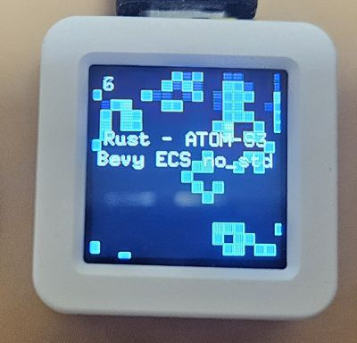
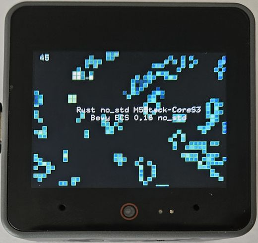
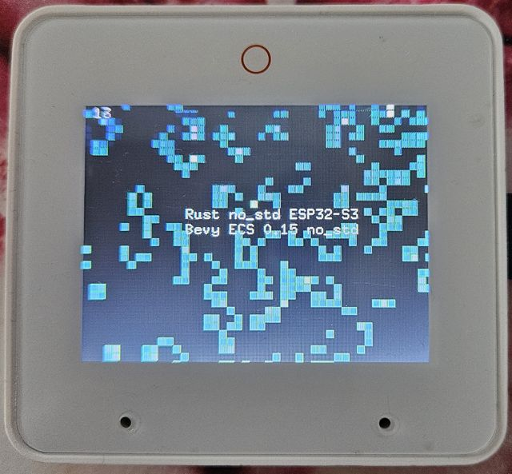
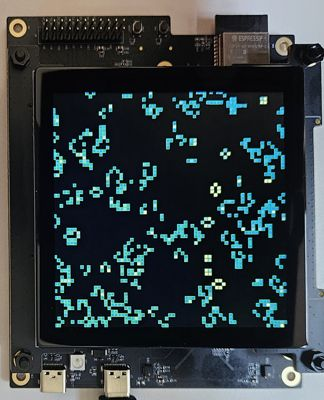
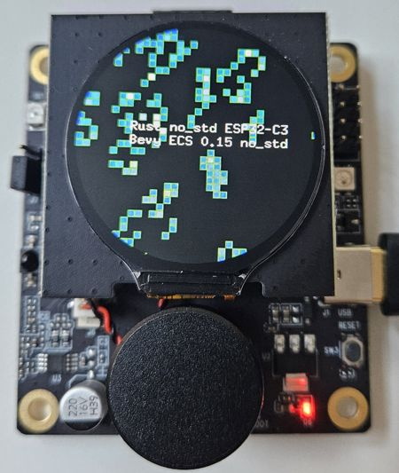
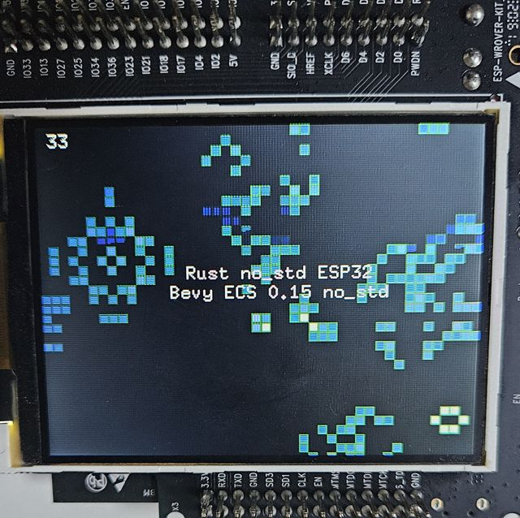

# ESP32 Conway's Game of Life in Rust

Implementation of Conway's Game of Life Rust Bare Metal.

[](https://wokwi.com/projects/380370193649185793)


## Supported boards

### ESP32-S3-BOX-3 Minimal Implementation

- https://github.com/espressif/esp-box

The implementation is based on Rust no\_std, using mipidsi crate.

```
cd esp32-s3-box-3-minimal
cargo run --release
```

### ESP32-C6-LCD-1.47 Waveshare

[Rust Bare Metal no_std](https://developer.espressif.com/blog/2025/02/rust-esp-hal-beta/) with [Bevy ECS no_std](https://github.com/bevyengine/bevy/issues/15460) on 1.47 inch [ESP32-C6 LCD Waheshare](https://www.waveshare.com/esp32-c6-lcd-1.47.htm) with DMA and framebuffer - [Conway's Game of Life](https://github.com/georgik/esp32-conways-game-of-life-rs/tree/main/esp32-c6-waveshare-1_47):

<video src="https://github.com/user-attachments/assets/e9d48ff7-b14c-4874-9521-fe59e915bc76" controls width="640">
View the video [here](https://github.com/user-attachments/assets/e9d48ff7-b14c-4874-9521-fe59e915bc76).
</video>

The implementation is based on Rust no\_std and Bevy 0.15 no\_std, plus mipidsi crate

```
cd esp32-c6-waveshare-1_47
cargo run --release
```

### M5Stack Atom-S3



- https://docs.m5stack.com/en/core/AtomS3

Controls: Press button under display to reset the game state (GPIO 41).

The implementation is based on Rust no\_std, using mipidsi crate and Bevy ECS.
It requires es-rs toolchain for ESP32-S3 version at [least 1.85](https://github.com/esp-rs/rust-build/releases/tag/v1.85.0.0), because of edition 2024.

Installation of the toolchain:

```
cargo install espup
espup install --toolchain-version 1.85.0.0
source ~/export-esp.sh
```

Build:

```
cd m5stack-atom-s3
cargo run --release
```

### M5Stack CoreS3



- https://shop.m5stack.com/products/m5stack-cores3-esp32s3-lotdevelopment-kit

Controls: Press the button under display to reset the game state.

Note: Press Boot button and reset to enter download mode.

The implementation is based on Rust no\_std, using mipidsi crate and Bevy ECS.

Installation of the toolchain:

```
espup install --toolchain-version 1.85.0.0
source ~/export-esp.sh
```

Build:

```
cd m5stack-cores3
cargo run --release
```

### ESP32-S3-BOX-3



- https://github.com/espressif/esp-box

The implementation is based on Rust no\_std, using mipidsi crate and Bevy ECS.
It requires es-rs toolchain for ESP32-S3 version at [least 1.85](https://github.com/esp-rs/rust-build/releases/tag/v1.85.0.0), because of edition 2024.

Installation of the toolchain:

```
cargo install espup
espup install --toolchain-version 1.85.0.0
source ~/export-esp.sh
```

Build:

```
cd esp32-s3-box-3
cargo run --release
```

### ESP32-S3-LCD-Ev-Board



[ESP32-S3-LCD-Ev-Board](https://docs.espressif.com/projects/esp-dev-kits/en/latest/esp32s3/esp32-s3-lcd-ev-board/index.html)
is more complex when it comes to the display. Initialization sequence for the display is:
- initialize I2C
- tunnel SPI commands via I2C bus
- configure 16 GPIOs to transfer data
- all data must be transferred in one transaction (requires PSRAM)

The timing of the display must be precise, otherwise incorrect data will be displayed.

Working configuration of timing:

```rust
    // Configure the RGB display
    let config = Config::default()
        .with_clock_mode(ClockMode {
            polarity: Polarity::IdleLow,
            phase: Phase::ShiftLow,
        })
        .with_frequency(Rate::from_mhz(10))
        .with_format(Format {
            enable_2byte_mode: true,
            ..Default::default()
        })
        .with_timing(FrameTiming {
            // active region
            horizontal_active_width: 480,
            vertical_active_height: 480,
            // extend total timings for larger porch intervals
            horizontal_total_width: 600, // allow long back/front porch
            horizontal_blank_front_porch: 80,
            vertical_total_height: 600,  // allow longer vertical blank
            vertical_blank_front_porch: 80,
            // maintain sync widths
            hsync_width: 10,
            vsync_width: 4,
            // place HSYNC pulse well before active data
            hsync_position: 10,
        })
        .with_vsync_idle_level(Level::High)
        .with_hsync_idle_level(Level::High)
        .with_de_idle_level(Level::Low)
        .with_disable_black_region(false);
```

This is only bare metal implementation, does not contain Bevy ECS in this version.

```
cargo install espup
espup install --toolchain-version 1.85.0.0
source ~/export-esp.sh
```

Build:

```
cd esp32-s3-lcd-ev-board
cargo run --release
```


### ESP32-C3-LCDKit



Controls: Press button rotary button to reset the game state (GPIO 9).

```
cd esp32-c3-lcdkit
cargo run --release
```

### ESoPe SLD\_C\_W\_S3

Board: [SDL\C\_W\_S3](https://esope.de/en/products)
Display: RGB [Schukat Smartwin display-concept](https://shop.schukat.com/de/de/EUR/c/ESOP)

The implementation is based on Embassy Async Rust no\_std with RGB interface.
Both cores of ESP32-S3 are used. One core is handling DMA transfers to the display, 
while the other core is running the game logic.

RGB displays are very time-sensitive, so the timing of the display must be precise, that's also why
one core is dedicated to the display.

The display configuration is stored in EEPROM for this specific display type.

```
esope-sld-c-w-s3
cargo r -r
```

### WASM

This is experimental implementation for WASM.

```
cd wasm
wasm-pack build --target web
wasm-bindgen --target web --out-dir pkg target/wasm32-unknown-unknown/release/conways_wasm.wasm
python3 -m http.server
```

### ESP32-WROVER-KIT

This board is no longer in production, yet it's still used by many developers.



The implementation is based on Rust no\_std, using mipidsi crate and Bevy ECS.
It requires es-rs toolchain for ESP32-S3 version at [least 1.85](https://github.com/esp-rs/rust-build/releases/tag/v1.85.0.0), because of edition 2024.

Installation of the toolchain:

```
cargo install espup
espup install --toolchain-version 1.85.0.0
source ~/export-esp.sh
```

Build:

```
cd esp32-wrover-kit
cargo run --release
```


