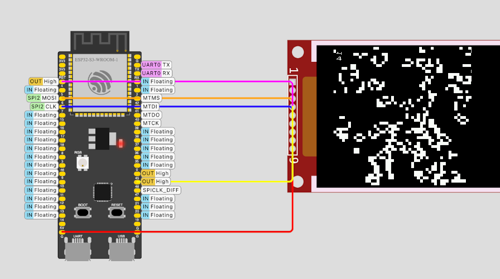

# ESP32 Conway's Game of Life in Rust

Implementation of Conway's Game of Life Rust Bare Metal.

[](https://wokwi.com/projects/380370193649185793)



## Supported boards

### ESP32-S3-BOX-3

- https://github.com/espressif/esp-box

The implementation is based on Rust no\_std, using mipidsi crate.

```
cargo run --release
```

### ESP32-C6-1.47 Waveshare

- https://www.waveshare.com/esp32-c6-lcd-1.47.htm

The implementation is based on Rust no\_std and Bevy 0.15 no\_std, plus mipidsi crate

```
cargo run --release
```

